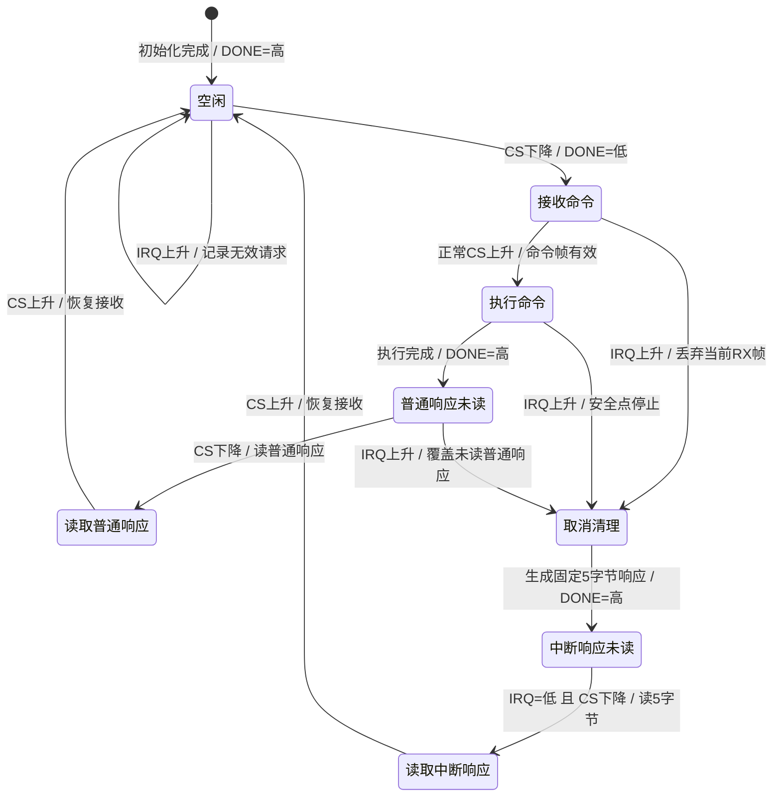
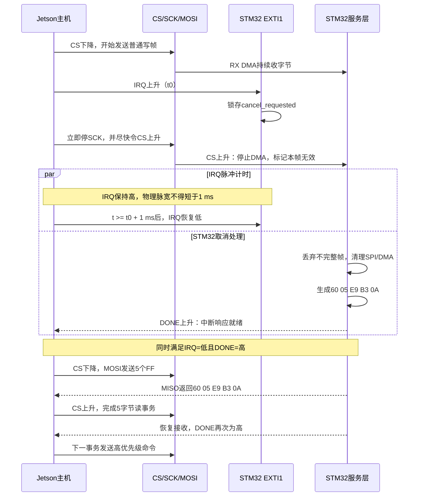
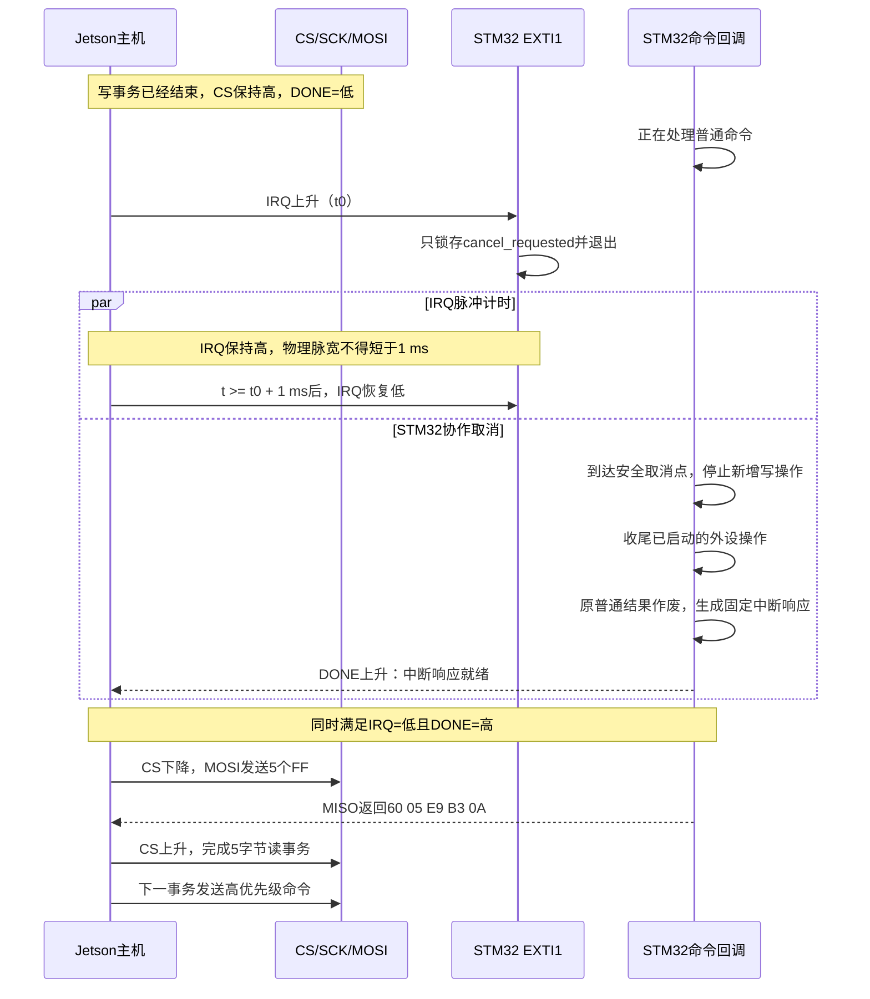
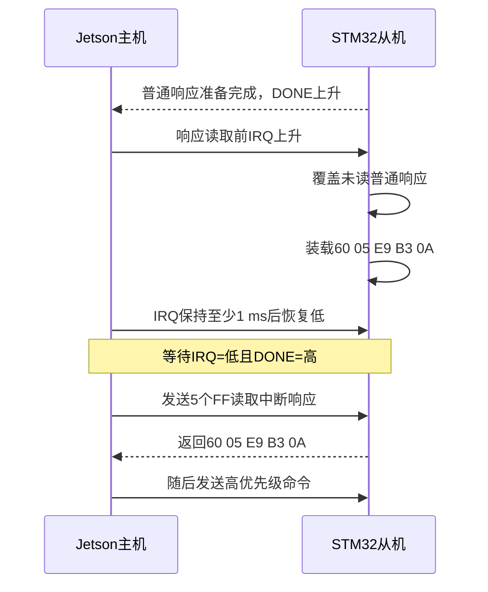

# IRQ 命令中断管脚设计

状态：设计稿；只规定后续实现所需的管脚、电气、时序和协议行为，当前代码尚未启用 IRQ。

## 作用和方向

IRQ 用于 Jetson 请求 STM32 中止当前普通命令，以便随后发送更高优先级命令。它不是 MCU 向主机发起的传统外设中断线，而是主机到从机的主动高脉冲：

| 信号 | STM32F407 | Jetson Orin Nano J12 | 方向 | 空闲电平 |
|---|---|---|---|---|
| IRQ | PB1，GPIO 输入 + EXTI1 上升沿 | Pin 22，GPIO 输出 | Jetson -> STM32 | 低 |
| GND | GND | 任意 GND | 共地 | - |

两端使用 3.3 V 电平。IRQ 建议外接 10 kΩ 下拉到 GND，避免 Jetson 复位、引脚高阻或连线断开时误触发。STM32 PB1 不属于默认 SPI1 的 PA4～PA7、DONE 的 PB0，也不属于原 SPI Flash 例程的 PB3/PB4/PB5/PB14；PB1 可直接映射到 EXTI1。Jetson Pin 22 不占用计划使用的 `spi1 (19,21,23,24,26)`，但启用 IRQ 后不得再启用会占用 Pin 22 的 `spi3`。

## 高电平持续时间

IRQ 空闲为低，Jetson 请求中断时拉高，并在物理引脚上保持至少 `1 ms` 后再恢复低电平；正常目标范围为 `1～2 ms`。STM32 只用上升沿锁存一次中断请求，高电平持续期间不得重复计数。IRQ 连续高于 `10 ms` 时按线路卡高处理，不把它解释成多个请求；恢复低电平后才允许下一次上升沿。

选择 `1 ms` 的依据：

- 当前 SPI 为 100 kHz，每 bit 为 10 us、每字节为 80 us；1 ms 覆盖 12.5 个字节时间，远大于 EXTI 边沿识别和短中断临界区所需时间。
- STM32F407 当前运行在 168 MHz，EXTI 正常响应通常是微秒级；留出 1 ms 是为了覆盖 CS 上升沿、DMA 停止等更高优先级短处理，而不是因为 EXTI 本身需要毫秒脉冲。
- Linux 用户态 GPIO 和调度存在抖动，几十微秒脉冲不适合作为板间协议。实现必须保证实测高电平不短于 1 ms，可以晚恢复低电平，但不能提前。
- 最大 256 字节写帧在 100 kHz 下约为 20.48 ms，1～2 ms 相对较短，同时足以用逻辑分析仪稳定测量。

Jetson 可使用单调时钟的绝对定时等待到“不早于上升沿后 1 ms”再拉低 IRQ。验收以示波器或逻辑分析仪测到的引脚脉宽为准，不能只以用户态休眠参数为准。

## 中断时序

IRQ 只在一条普通命令尚未读取响应时有效。Jetson 必须串行控制 SPI、IRQ 和 DONE，不能让另一个进程同时访问这些线。

下面先给出完整状态关系。`DONE=低` 表示 STM32 尚未完成当前阶段；IRQ 可以在“接收命令”“执行命令”和“普通响应未读”三个状态请求中断。中断响应被读走以后，主机才可以发送高优先级命令。



图中的关键屏障是：Jetson 只有同时观察到 `IRQ=低` 和 `DONE=高`，才能拉低 CS 读取中断响应。IRQ 脉冲结束与 STM32 取消清理完成没有固定先后关系，不能只等待其中一个信号。

### CS 为低，STM32 正在收帧

1. Jetson 拉高 IRQ 后立即停止继续产生 SCK，并尽快把 CS 拉高；不得把 CS 继续保持为低。IRQ 仍保持高，直到累计至少 1 ms 后才恢复低。
2. STM32 的 EXTI1 只锁存 `cancel_requested`，标记当前 RX DMA 数据无效。不得在 EXTI1 中解析帧、计算 CRC 或执行回调。
3. CS 上升沿完成 SPI/DMA 清理，但不发布或执行这份不完整命令。随后准备固定的 `CMD_INTERRUPTED_ERR` 响应。



这一种情况要求“IRQ 出现后停止 SCK，并把 CS 从低恢复为高”。不能继续把 CS 保持低，也不能在同一个 CS 低窗口内直接发送高优先级命令；当前不完整写帧必须先结束和清理。

当前 spidev 程序把完整写帧放在一次 `SPI_IOC_MESSAGE` 中，用户态不能保证从另一个线程立即终止已经提交给内核的传输。若要实现“收帧中立即停钟并拉高 CS”，Jetson 端需要可取消的内核驱动，或者改为 GPIO 手动 CS 与可中断的分段传输；这属于后续代码改造，不能只增加一个 GPIO 写操作就宣称实现。

### CS 为高，STM32 正在处理命令

1. EXTI1 锁存 `cancel_requested`；命令回调在安全取消点检查该标志，不再开始新的写入步骤，并对已经启动的外设操作做必要收尾。
2. 禁止在 EXTI1 中强制跳出任意回调或直接改写回调栈。Flash 写入、总线事务等不可原子撤销的动作可能已经部分或全部发生，因此 `CMD_INTERRUPTED_ERR` 表示“原命令结果已作废并收到停止请求”，不保证没有副作用。
3. 若普通响应刚生成但尚未被主机读取，IRQ 仍覆盖该未读响应，改为固定中断响应，保证主机不必判断竞态下应该读 5 字节还是 256 字节。



这一路径中 CS 在 IRQ 出现时本来就是高电平，因此 IRQ 脉冲期间不需要也不允许额外制造一个空的 CS 低窗口。只有固定中断响应准备好以后，Jetson 才为读取 5 字节响应拉低一次 CS。

### 普通响应刚好已经生成

这是执行阶段最容易出现竞态的边界。只要普通响应还没有被主机读走，IRQ 就具有覆盖权：STM32 丢弃未读普通响应，改为固定 5 字节中断响应。这样 Jetson 发出 IRQ 后始终按同一种方式读取，不需要猜测 MISO 上是普通变长响应还是中断响应。



STM32 完成取消清理并装载中断响应后，把 DONE 拉高。Jetson 必须等 IRQ 已恢复低且 DONE 为高，再开始读取中断响应；读走该响应后才能发送更高优先级命令。没有活动命令且没有未读响应时出现的 IRQ 只记录为无效请求，不生成返回帧。

## 固定中断返回帧

新增状态值 `CMD_INTERRUPTED_ERR = 0x05`。该响应没有 RESULT，逻辑帧和物理读事务都固定为 5 字节：

```text
60 05 E9 B3 0A
```

其中 `E9 B3` 是按现有 CRC16/MODBUS 对 `60 05` 计算得到的 `CRC_LO CRC_HI`。Jetson 读取该响应时只发送 5 个 `0xFF` 产生 5 字节时钟，不发送普通变长响应使用的 256 个占位字节，也没有帧后填充。STM32 必须只在当前待发响应类型为“IRQ 中断响应”时接受 5 字节读事务；普通响应仍按现有规则读取，二者不能靠扫描 `0x0A` 混淆。

固定响应读事务内恰好产生 `5 × 8 = 40` 个 SCK，不再追加用于普通变长响应的 251 字节时钟。读事务 CS 上升以后，STM32 才清除中断响应并恢复下一条命令的接收状态。

## 后续代码改造边界

- STM32：PB1 输入下拉、EXTI1 上升沿、锁存式取消标志、回调安全取消点、固定 5 字节中断响应以及 5 字节读事务收尾。
- Jetson：Pin 22 输出默认低、至少 1 ms 脉冲、可中断 SPI 写路径、等待 DONE、固定 5 字节读取和线路卡高检测。
- 共享协议：新增 `0x05` 状态，但不改变普通返回帧格式；为待发响应保存“普通/IRQ 固定帧”类型，不能仅靠长度猜测。
- 测试：覆盖收帧中断、执行中断、普通响应刚生成时中断、IRQ 空闲误触发、IRQ 卡高、固定帧 CRC、只读 5 字节以及取消后高优先级命令。

最终设计结论：IRQ 使用 STM32 PB1/EXTI1，连接 Jetson J12 Pin 22；空闲低、有效高，高电平实测至少 1 ms（建议 1～2 ms）；中断返回固定 5 字节，主机只发送 5 个 `0xFF` 读取。
